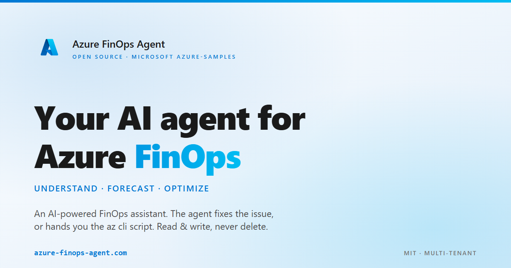
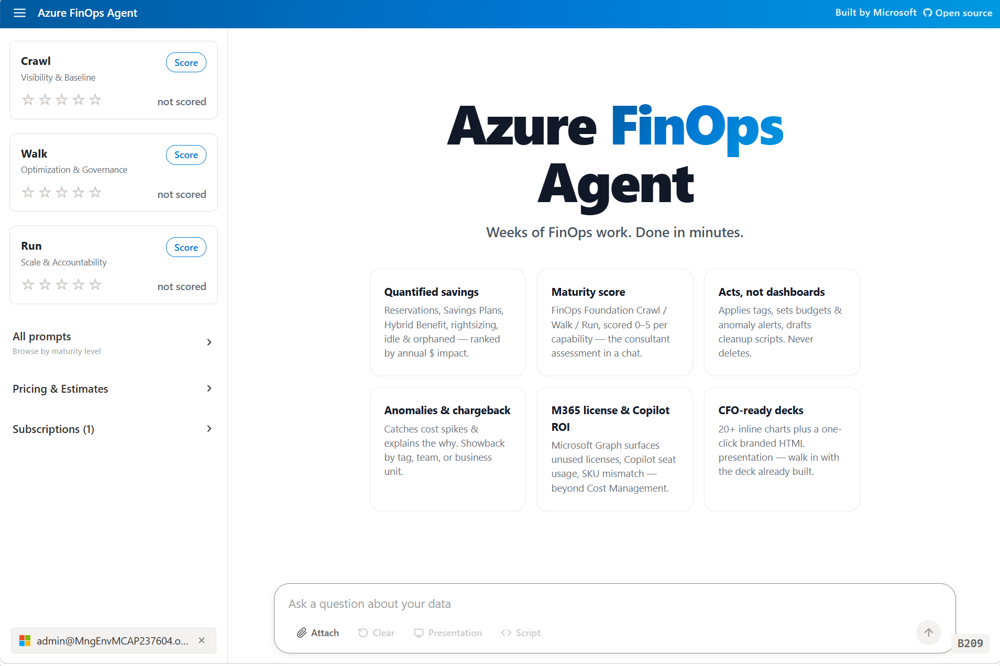

# Azure FinOps Agent

[](LICENSE)
[](https://azure-finops-agent.com)

**Replace a multi-week FinOps assessment with a single conversation.**

Quantified savings, a FinOps maturity score, a CFO-ready deck, and ready-to-run remediation scripts — in minutes.

The agent fixes the issue for you, or hands you the az&nbsp;cli script. Read &amp; write on your behalf, never delete. Your tenant. Your tokens. Your control.

## [Try it live →](https://azure-finops-agent.com) &nbsp;&nbsp;&nbsp; [📊 Pitch deck →](https://azure-finops-agent.com/slides)





## Try it without signing in

No Azure tenant? Two ways to demo:

- **Public pricing questions** — ask about Azure VM SKUs, regions, reservations, savings plans. Agent uses the public Retail Prices API (no auth).
- **Drop a sample file** — drag any CSV/JSON/XLSX/PDF from [`demo-data/`](demo-data/) into the chat. The agent inspects the schema, runs aggregates, and answers without ever loading the raw payload into the LLM. Includes realistic cost exports, Advisor JSON, audit logs, and FinOps notes.

## How it works

Vue 3 SPA → .NET 10 minimal API → GitHub Copilot SDK → Azure read APIs (Cost Management, Resource Graph, Microsoft Graph, Log Analytics) using your delegated Entra tokens. Hosted on Azure App Service or Container Apps. OpenTelemetry to your Application Insights.

## [See the architecture diagram →](https://azure-finops-agent.com/slides#4)

## Running Locally

### Prerequisites

- [.NET 10 SDK](https://dotnet.microsoft.com/download/dotnet/10.0)
- [Node.js 22+](https://nodejs.org/)
- [Azure CLI](https://learn.microsoft.com/cli/azure/install-azure-cli) — authenticated via `az login`
- An Azure OpenAI resource with a deployed model (e.g., `gpt-5.4`)

### One-time secret setup

Secrets are stored via [.NET User Secrets](https://learn.microsoft.com/aspnet/core/security/app-secrets) — **outside the repo**, in your OS user profile. They cannot be accidentally committed.

```powershell
cd src/Dashboard

# Required — the app throws InvalidOperationException on startup if this is missing:
dotnet user-secrets set "AzureOpenAI:Endpoint" "https://YOUR-RESOURCE.openai.azure.com/"

# Optional — set the model deployment name (defaults to gpt-5.4 if omitted):
dotnet user-secrets set "AzureOpenAI:DeploymentName" "gpt-5.4"

# Optional — enables the "Connect Azure" OAuth flow for Cost Management, Advisor, etc.:
dotnet user-secrets set "Microsoft:ClientId"     "YOUR-ENTRA-APP-CLIENT-ID"
dotnet user-secrets set "Microsoft:ClientSecret" "YOUR-ENTRA-APP-CLIENT-SECRET"
dotnet user-secrets set "Microsoft:TenantId"     "common"

# Optional — enables Application Insights telemetry:
dotnet user-secrets set "ApplicationInsights:ConnectionString" "InstrumentationKey=...;IngestionEndpoint=https://...;"
```

> **`AzureOpenAI:Endpoint` is the only fail-fast key** — the app will not start without it.  
> All other keys degrade gracefully (Azure connect is disabled, telemetry is skipped, etc.).

Run `dotnet user-secrets list` (from `src/Dashboard`) to verify what's stored.

### Build the frontend

```powershell
cd src/Dashboard/frontend
npm install
npm run build    # outputs to src/Dashboard/wwwroot/
```

### Run the backend

```powershell
cd src/Dashboard
$env:ASPNETCORE_ENVIRONMENT = "Development"
dotnet run --project Dashboard.csproj --urls "http://localhost:5000"
```

Open **http://localhost:5000**.

> If `AzureOpenAI:Endpoint` is not set, the app **intentionally crashes** with an `InvalidOperationException` telling you exactly which `dotnet user-secrets set` command to run. This is the fail-fast safety net.

### Where do my secrets live?

User Secrets are stored **outside the repo** — they can never be accidentally committed:

- **Windows:** `%APPDATA%\Microsoft\UserSecrets\1190b8a4-6595-436b-9479-b9951bd00f16\secrets.json`
- **macOS / Linux:** `~/.microsoft/usersecrets/1190b8a4-6595-436b-9479-b9951bd00f16/secrets.json`

### Production

In production (Azure App Service), the same configuration keys are sourced from environment variables / App Service application settings via the standard `IConfiguration` environment-variable provider — e.g., `AzureOpenAI__Endpoint`, `Microsoft__ClientId`. Environment variables always take precedence over User Secrets; User Secrets only loads when `ASPNETCORE_ENVIRONMENT=Development`.

## Deployment secrets

The deploy workflow (`deploy.yml`) injects secrets into App Service as application settings at deploy time. Add them under **Settings → Secrets and variables → Actions → New repository secret** in the GitHub UI.

| GitHub Secret name      | App Service setting     | Purpose                                        |
| ----------------------- | ----------------------- | ---------------------------------------------- |
| `AZURE_OPENAI_ENDPOINT` | `AzureOpenAI__Endpoint` | Azure OpenAI resource URL — **required**       |
| `AZURE_CLIENT_ID`       | _(OIDC login)_          | Managed identity / service principal client ID |
| `AZURE_TENANT_ID`       | _(OIDC login)_          | Azure AD tenant ID                             |
| `AZURE_SUBSCRIPTION_ID` | _(OIDC login)_          | Target subscription ID                         |

> **Convention:** App Service application settings use `__` (double underscore) to map to .NET `IConfiguration` hierarchy — `AzureOpenAI__Endpoint` maps to `AzureOpenAI:Endpoint`. Follow the same pattern for any future secrets (e.g., `Microsoft__ClientId` → `Microsoft:ClientId`).
>
> To add a new secret: (1) create it in the GitHub UI, (2) add `KEY="${{ secrets.SECRET_NAME }}"` to the `--settings` list in the `Configure App Service settings` step of `deploy.yml`.

> **Tip for local dev:** Besides `dotnet user-secrets`, you can also export `AzureOpenAI__Endpoint` as a shell environment variable (`$env:AzureOpenAI__Endpoint = "..."` in PowerShell) — environment variables are picked up by `IConfiguration` automatically and take precedence over User Secrets.

## License

[MIT](LICENSE) · See [CONTRIBUTING.md](CONTRIBUTING.md) · [Code of Conduct](https://opensource.microsoft.com/codeofconduct/)
