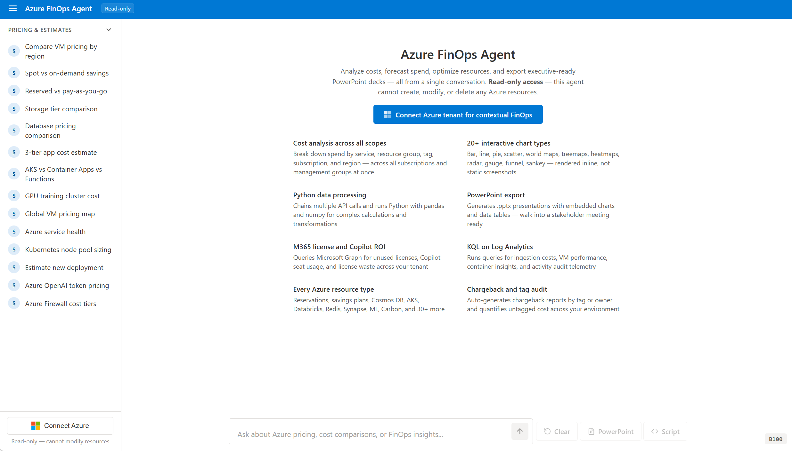

# Azure FinOps Agent

AI-powered conversational agent that turns Azure cost data into action. Connect your tenant, ask questions in natural language, and get live insights, interactive charts, executive-ready PowerPoint decks, and ready-to-run remediation scripts — what used to take months of FinOps work now takes days.

**[Live demo →](https://azure-finops-agent.com)**



## What It Does

- **Ask anything about your Azure spend** — cost breakdowns, trends, forecasts, anomalies, idle resources, right-sizing opportunities
- **Interactive visualizations** — bar, line, pie, scatter, funnel, world maps, heatmaps, treemaps, radar, and gauge charts rendered inline
- **Generate PowerPoint decks** — executive-ready FinOps presentations with embedded charts, exported as `.pptx`
- **Generate remediation scripts** — downloadable Azure CLI or PowerShell scripts with dry-run mode, confirmation prompts, and `--what-if` safety flags
- **FinOps maturity assessment (Crawl / Walk / Run)** — structured scoring framework aligned with the FinOps Foundation, evaluating tagging, orphaned resources, reservations, budgets, right-sizing, cost allocation, and more — each dimension scored 0–5 with actionable recommendations to level up
- **License optimization** — surface unused M365 seats, Copilot adoption gaps, and license waste across Exchange, Teams, OneDrive, and SharePoint
- **Chargeback & showback** — map costs to departments, teams, and business units using Microsoft Graph directory data
- **Log Analytics deep dives** — KQL queries against workspaces and App Insights for VM metrics, container diagnostics, and ingestion cost analysis

## Architecture

```
┌────────────────────────────────────────────────────────────────────────────┐
│                     Azure App Service (Docker, Linux P0v3)                 │
│                                                                            │
│  ┌────────────────────┐    SSE/POST    ┌────────────────────────────────┐  │
│  │   Vue 3 + Vite     │◄─────────────►│   .NET 10 Minimal API          │  │
│  │   ECharts          │               │   GitHub Copilot SDK (BYOK)    │  │
│  │   App Insights JS  │               │   Azure OpenAI via Entra ID    │  │
│  └────────────────────┘               └───────────────┬────────────────┘  │
│                                                       │ orchestrates       │
│                                             ┌─────────┴──────────┐        │
│                                             │    11 Agent Tools   │        │
│                                             └─────────┬──────────┘        │
│                                                       │                    │
│  ┌─ Auth ──────────────────────────────────────────────┤                   │
│  │  Entra ID OAuth (multi-tenant, incremental consent) │                   │
│  │  4 tiers: ARM · Graph (2×) · Log Analytics          │                   │
│  └─────────────────────────────────────────────────────┘                   │
│                                                                            │
│  ┌─ Observability ─────────────────────────────────────┐                   │
│  │  OpenTelemetry · Azure Monitor · Application Insights│                  │
│  └──────────────────────────────────────────────────────┘                  │
└───────────────────────────────────┬────────────────────────────────────────┘
                                    │
          ┌─────────────────────────┼─────────────────────────┐
          │                         │                         │
 ┌────────▼─────────┐    ┌─────────▼──────────┐    ┌─────────▼──────────┐
 │  Azure ARM APIs  │    │  Microsoft Graph   │    │  Log Analytics     │
 │  ────────────────│    │  ─────────────────  │    │  ─────────────────  │
 │  Cost Management │    │  License inventory │    │  KQL queries       │
 │  Billing         │    │  M365 usage reports│    │  App Insights      │
 │  Advisor         │    │  Directory / Org   │    │  VM & container    │
 │  Resource Graph  │    │  Copilot seat usage│    │    metrics         │
 │  Monitor / VMs   │    │  Intune devices    │    │  Ingestion cost    │
 │  Reservations    │    └────────────────────┘    │    analysis        │
 │  Savings Plans   │                              └────────────────────┘
 │  AKS / Storage   │    ┌────────────────────┐    ┌────────────────────┐
 │  SQL / Cosmos DB  │    │  Azure Retail      │    │  Azure Status      │
 │  App Service     │    │  Prices API        │    │  RSS Feed          │
 │  + 20 more...    │    │  (no auth)         │    │  (no auth)         │
 └──────────────────┘    └────────────────────┘    └────────────────────┘
```

### Tools

| Tool                    | What it does                                                                                                                 |
| ----------------------- | ---------------------------------------------------------------------------------------------------------------------------- |
| `QueryAzure`            | ARM REST (GET + read-only POST) — Cost Mgmt, Billing, Advisor, Resource Graph, Monitor, VMs, AKS, Storage, SQL, 30+ services |
| `QueryGraph`            | Graph GET — license inventory, M365 usage, directory, org chargebacks                                                        |
| `QueryLogAnalytics`     | KQL against Log Analytics / App Insights                                                                                     |
| `RenderChart`           | Inline ECharts (bar, line, pie, scatter, funnel, maps, heatmaps, treemaps, radar, gauge)                                     |
| `GeneratePresentation`  | FinOps PowerPoint decks (python-pptx + matplotlib)                                                                           |
| `GenerateScript`        | Downloadable Azure CLI / PowerShell remediation scripts                                                                      |
| `ReportMaturityScore`   | FinOps maturity scoring (Crawl / Walk / Run, 0–5 per dimension)                                                              |
| `GetAzureServiceHealth` | Azure Status RSS (no auth)                                                                                                   |
| `PublishFAQ`            | Dynamic SEO pages + IndexNow                                                                                                 |
| `SuggestFollowUp`       | Clickable follow-up actions                                                                                                  |
| _Built-in (SDK)_        | bash, Python 3, file ops, web fetch, grep, glob, memory                                                                      |

### Auth & Security

No login required for chat. Azure data via incremental OAuth consent:

| Tier                   | Scopes                                      |
| ---------------------- | ------------------------------------------- |
| Connect Azure          | `user_impersonation` (ARM)                  |
| + License Optimization | `Organization.Read.All`, `Reports.Read.All` |
| + Cost Allocation      | `User.Read.All`, `Group.Read.All`           |
| + Log Analytics        | `Data.Read`                                 |

**Strictly read-only** — PUT/PATCH/DELETE blocked at code level. POST restricted to allowlisted read-only endpoints. Recommended RBAC: `Reader` or `Cost Management Reader`.

## Project Structure

```
src/Dashboard/
├── Program.cs                  # App startup, auth, SSE chat endpoint
├── Auth/
│   └── TokenContext.cs         # Per-user token management
├── AI/Tools/
│   ├── AzureQueryTools.cs      # ARM REST APIs
│   ├── GraphQueryTools.cs      # Microsoft Graph
│   ├── LogAnalyticsQueryTools.cs
│   ├── ChartTools.cs           # ECharts rendering
│   ├── PresentationTools.cs    # PowerPoint generation
│   ├── ScoreTools.cs           # FinOps maturity scoring
│   ├── ScriptTools.cs          # Remediation scripts
│   ├── HealthTools.cs          # Azure Status RSS
│   ├── FaqTools.cs             # SEO FAQ pages
│   └── FollowUpTools.cs        # Follow-up suggestions
├── Infrastructure/
│   ├── HttpHelper.cs           # HTTP retry + formatting
│   └── TempFileHelper.cs       # Temp file cleanup
├── client/                     # Vue 3 + Vite SPA
│   └── src/components/
│       ├── ChatView.vue        # Chat UI, tool sidebar, ECharts
│       └── Dashboard.vue       # Layout shell
├── Dockerfile                  # Multi-stage (Node → .NET → runtime + Python)
└── setup-entra-app.ps1         # Entra ID app registration
```

## Contributing

See [CONTRIBUTING.md](CONTRIBUTING.md). This project uses the [Microsoft Open Source Code of Conduct](https://opensource.microsoft.com/codeofconduct/).

## License

[MIT](LICENSE)
