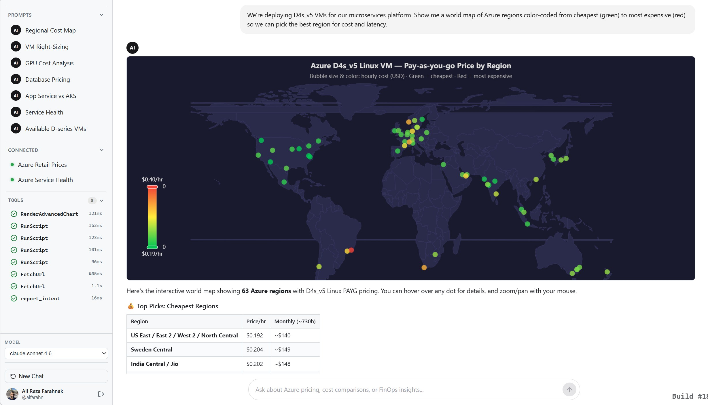

# Azure FinOps Agent

An AI-powered agent that helps Azure customers **optimize cloud costs** through a conversational interface. Ask questions in natural language and get actionable FinOps insights — from identifying idle resources and oversized VMs to forecasting spend and analyzing reservation utilization.

Built with .NET 10, Vue 3, and the GitHub Copilot SDK. Deploys to Azure App Service.

**[Try it live →](https://azure-finops-agent.com/)**



## Features

- **Conversational cost analysis** — ask questions about Azure pricing, compare VM families, forecast spend, and explore cost scenarios in natural language
- **Live Azure tenant data** — connect your Azure account to query Cost Management, Billing, Advisor recommendations, Resource Graph, Azure Monitor, Resource Health, Reservations, Savings Plans, and more via delegated OAuth
- **Microsoft Graph integration** — license inventory, directory objects, and org structure for FinOps chargebacks
- **Log Analytics & App Insights** — run KQL queries against Log Analytics workspaces and Application Insights for VM/container metrics and ingestion cost analysis
- **Interactive data visualizations** — ECharts-powered charts (bar, line, pie, scatter, funnel, world maps, heatmaps, treemaps, radar, gauge) rendered inline in chat
- **Public Azure data** — real-time pricing from the Azure Retail Prices API and service health from the Azure Status RSS feed (no auth required)
- **Code execution** — runs Python 3, bash, and SQLite scripts for data processing and analysis (pandas, numpy, requests available)
- **Streaming responses** — Server-Sent Events (SSE) for real-time streaming text, tool call status, and chart rendering
- **Model selection** — choose from available GitHub Copilot models (Claude, GPT, etc.)
- **Observability** — OpenTelemetry + Azure Monitor (Application Insights) with structured traces, custom metrics (chat requests, tool calls, errors, token refreshes, session lifecycle, duration histograms), and activity spans for chat requests, tool calls, and AI responses

## Architecture

```
┌─────────────────┐    SSE     ┌──────────────────────────────────┐
│  Vue 3 + Vite   │◄──────────│  .NET 10 Minimal API             │
│  (ECharts)       │──────────►│  GitHub Copilot SDK              │
└─────────────────┘   POST    │                                  │
                               │  Tools:                          │
┌─────────────────┐            │  ├─ QueryAzure (ARM REST APIs)   │
│  GitHub OAuth   │◄──────────│  ├─ QueryGraph (Microsoft Graph)  │
│  (Copilot +     │            │  ├─ QueryLogAnalytics (KQL)      │
│   Identity)     │            │  ├─ FetchUrl (Retail Prices)     │
└─────────────────┘            │  ├─ GetAzureServiceHealth (RSS)  │
                               │  ├─ RenderChart / Advanced       │
┌─────────────────┐            │  └─ RunScript (Python/bash/SQL)  │
│  Microsoft      │◄──────────│                                  │
│  Entra ID OAuth │            └──────────────────────────────────┘
│  (ARM + Graph   │
│   + Log Analyt.)│
└─────────────────┘
```

The agent follows an **agentic architecture** — the AI orchestrates calls to multiple data sources and tools to answer user questions. The backend streams responses via SSE, and the frontend renders streaming text, tool call status in a sidebar, and ECharts visualizations inline.

## Getting Started

### Prerequisites

- [GitHub account](https://github.com) with [Copilot](https://github.com/features/copilot) access
- [.NET 10 SDK](https://dotnet.microsoft.com/download)
- [Node.js LTS](https://nodejs.org/)
- GitHub App OAuth credentials (see [CONTRIBUTING.md](CONTRIBUTING.md) for setup)
- _(Optional)_ [Azure subscription](https://azure.microsoft.com/free/) + Microsoft Entra ID app registration for Azure tenant data
- _(Optional)_ [Azure CLI](https://learn.microsoft.com/cli/azure/install-azure-cli) for deployment

### Run Locally

> **Important**: You must set `ASPNETCORE_ENVIRONMENT=Development` to load local OAuth credentials.

```bash
# Build the Vue frontend
cd src/Dashboard/client
npm install
npm run build

# Start the .NET backend
cd ../
$env:ASPNETCORE_ENVIRONMENT="Development"
dotnet run --urls "http://localhost:5000"

# Open http://localhost:5000
```

### Deploy to Azure

```powershell
cd src/Dashboard

# First deploy (creates App Service infrastructure)
.\deploy.ps1 -ResourceGroup "rg-finops-agent" -AppName "finops-agent"

# Subsequent deploys (skip infrastructure creation)
.\deploy.ps1 -ResourceGroup "rg-finops-agent" -AppName "finops-agent" -SkipInfra
```

The deploy script builds the frontend, publishes the .NET backend, configures OAuth secrets as encrypted app settings, and deploys via `az webapp deploy --type zip` to a Linux App Service.

## Project Structure

```
src/Dashboard/
├── Program.cs                 # Auth endpoints, SSE chat, models, version
├── Dashboard.csproj           # .NET 10, GitHub.Copilot.SDK, Microsoft.Extensions.AI
├── Tools/
│   ├── AzureQueryTools.cs     # QueryAzure — any Azure ARM REST API (GET/POST)
│   ├── ChartTools.cs          # RenderChart + RenderAdvancedChart — ECharts
│   ├── CodeExecutionTools.cs  # RunScript — Python 3, bash, SQLite
│   ├── GraphQueryTools.cs     # QueryGraph — Microsoft Graph API
│   ├── HealthTools.cs         # GetAzureServiceHealth — Azure Status RSS
│   ├── LogAnalyticsQueryTools.cs  # QueryLogAnalytics — KQL queries
│   ├── PricingTools.cs        # FetchUrl — Azure Retail Prices + public URLs
│   └── TokenContext.cs        # AsyncLocal per-request token isolation
├── client/                    # Vue 3 + Vite SPA
│   ├── src/components/
│   │   ├── ChatView.vue       # Chat UI, tool sidebar, ECharts rendering
│   │   ├── LoginScreen.vue    # GitHub OAuth login card
│   │   └── Dashboard.vue      # Layout shell
├── deploy.ps1                 # Azure App Service deployment script
├── startup.sh                 # App Service startup — installs Python/tools
└── appsettings.json           # Base config (empty secrets — safe to commit)
```

## Contributing

See [CONTRIBUTING.md](CONTRIBUTING.md). This project has adopted the [Microsoft Open Source Code of Conduct](https://opensource.microsoft.com/codeofconduct/).

## Maintainers

- [Anders Ravnholt](https://github.com/aravnholt)
- [Klaus Gjelstrup Nielsen](https://github.com/klausnielsen)
- [Abishek Narayan](https://github.com/abnaraya)
- [Ali Farahnak](https://github.com/alfarahn)

## License

MIT — see [LICENSE](LICENSE).

## Disclaimers

This Software requires the use of third-party components which are governed by separate proprietary or open-source licenses as identified below, and you must comply with the terms of each applicable license in order to use the Software. You acknowledge and agree that this license does not grant you a license or other right to use any such third-party proprietary or open-source components.

To the extent that the Software includes components or code used in or derived from Microsoft products or services, including without limitation Microsoft Azure Services (collectively, "Microsoft Products and Services"), you must also comply with the Product Terms applicable to such Microsoft Products and Services. You acknowledge and agree that the license governing the Software does not grant you a license or other right to use Microsoft Products and Services. Nothing in the license or this ReadMe file will serve to supersede, amend, terminate or modify any terms in the Product Terms for any Microsoft Products and Services.

You must also comply with all domestic and international export laws and regulations that apply to the Software, which include restrictions on destinations, end users, and end use. For further information on export restrictions, visit https://aka.ms/exporting.
