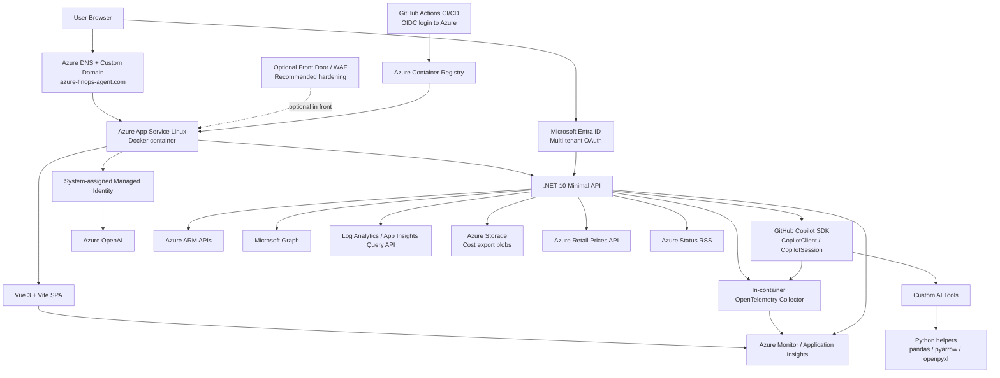

# Azure FinOps Agent — Architecture and Security

This document explains the Azure infrastructure architecture behind the **Azure FinOps Agent** solution and describes its security posture, including how it reduces the risk of **elevation of privilege**, **data exfiltration**, and other common threats.

## Overview

Azure FinOps Agent is a containerized AI-enabled web application hosted on **Azure App Service for Linux**. It combines:

- a **Vue 3** frontend
- a **.NET 10 minimal API** backend
- **GitHub Copilot SDK** session orchestration
- **Azure OpenAI** access via **managed identity**
- **Microsoft Entra ID delegated OAuth** for customer data access
- **OpenTelemetry + Azure Monitor + Application Insights** for observability

The application is designed to let users query Azure cost, billing, inventory, governance, monitoring, and optimization data through a conversational interface.

---

## Mermaid architecture diagram

---

## Infrastructure architecture

## 1. Application hosting

The solution runs as a **single containerized application** on **Azure App Service for Linux**.

Inside the container:

- the **frontend** is a Vue SPA
- the **backend** is a .NET 10 minimal API
- the backend orchestrates AI tool usage and outbound API calls
- Python is included for:
  - report generation
  - chart/image generation
  - uploaded file analysis

This is operationally simple: one deployed container hosts the user interface, API, AI orchestration, and helper runtimes.

### Why App Service is a good fit here

- managed PaaS hosting
- easy container deployment
- built-in TLS/custom domain support
- app settings / secret configuration
- managed identity support
- straightforward CI/CD integration
- scale-up/scale-out without managing AKS

---

## 2. Container build and deployment

The image is built as a **multi-stage Docker build**:

1. **Node** stage builds the Vue frontend
2. **.NET SDK** stage restores and publishes the backend
3. **ASP.NET runtime** stage hosts the final app and includes Python dependencies

The final runtime image also includes:

- Python 3
- pandas / numpy / pyarrow
- pdfminer.six
- pyarrow
- pdfminer
- OpenTelemetry Collector

### Deployment flow

1. Developers push changes to GitHub
2. **GitHub Actions** builds the image
3. Workflow authenticates to Azure using **OIDC**
4. Image is pushed to **Azure Container Registry**
5. App Service pulls the new image and restarts

This avoids long-lived Azure credentials in GitHub Actions when configured correctly.

---

## 3. Azure services involved

The core Azure services behind the solution are:

- **Azure App Service** — main runtime host
- **Azure Container Registry** — image storage
- **Azure OpenAI** — LLM endpoint
- **Microsoft Entra ID** — authentication and delegated authorization
- **Azure Monitor / Application Insights** — telemetry and diagnostics
- **Azure DNS** — custom domain resolution
- **Azure Storage** — optional customer cost-export blob access

### External/public endpoints also used

- **Azure Retail Prices API**
- **Azure Status RSS feed**

---

## 4. Identity model

This solution uses **two distinct trust paths**:

### A. App identity: managed identity

The app uses an **Azure managed identity** to authenticate to **Azure OpenAI**.

This means:

- no Azure OpenAI key needs to be embedded in code
- no client secret is required for this path
- Azure RBAC controls what the app identity can do
- token issuance is handled by Azure

This is the preferred cloud-native pattern.

### B. User identity: delegated OAuth

When the user wants tenant-specific Azure/Microsoft data, the app uses **Microsoft Entra ID OAuth** and stores **delegated tokens** per user session.

The user can grant scopes incrementally for:

- Azure ARM
- Microsoft Graph
- Log Analytics
- Azure Storage

This means the app does **not** automatically have broad access to customer data. Access is constrained by:

- the specific OAuth scopes granted
- the user’s own RBAC / directory permissions
- code-level restrictions in the app

---

## 5. Data flow

### Anonymous/public usage

Without Azure sign-in, users can still use features based on public or uploaded data, such as:

- pricing lookups
- Azure service health
- uploaded file analysis
- charts and presentations

### Authenticated usage

When a user connects Azure:

1. user authenticates with Entra ID
2. delegated token is issued to the application
3. backend stores token in session-scoped user state
4. AI tools call downstream APIs using that delegated token
5. returned data is summarized and presented back to the user

This architecture keeps the application as an orchestrator, while authorization remains tied to the user.

---

## Security model

## 1. Principle of least privilege

The design intentionally reduces default access:

- no Azure login required for public features
- only **base ARM consent** requested initially
- Graph / Log Analytics / Storage permissions are opt-in
- Azure OpenAI uses **managed identity** rather than a shared secret
- downstream access is based on **delegated user permissions**, not broad service-side admin access

This is one of the strongest parts of the design.

---

## 2. How the solution prevents elevation of privilege

“Elevation of privilege” means the system lets a user do more than they should be allowed to do.

This solution mitigates that risk in several ways.

### A. Delegated tokens inherit the user’s own rights

For Azure ARM access, the app uses the user's delegated token. That means the app can only act within the user’s RBAC boundary.

If the user is:

- **Reader** → they can read, but cannot make changes
- **Contributor** → they can make non-delete changes allowed by the app
- **Cost Management Reader** → they can inspect cost data but not change infrastructure

So the app does **not** magically upgrade the user.

### B. Incremental consent reduces over-permissioning

The app does not request all scopes up front.

Instead, it asks only for the minimum required tier:

- base Azure access first
- Graph add-ons later
- Log Analytics later
- Storage later

This reduces the chance that every user session carries excessive privileges.

### C. Tool-level method restrictions

The code explicitly limits what the AI tools can do.

Key examples:

- `QueryAzure` accepts only:
  - `GET`
  - `POST`
  - `PUT`
  - `PATCH`
- `DELETE` is blocked at the helper layer
- Graph tool is **GET-only**
- Log Analytics tool is **read/query only**
- Storage tool is described as read-oriented for cost export blobs

This is critical: even if the model “wanted” to perform a destructive action, the tool layer narrows the possible operations.

### D. Delete is blocked in code

Even if the user has Azure RBAC allowing deletion, the app itself blocks `DELETE`.

This is an important defense-in-depth measure:

- RBAC says what the user _could_ do in Azure generally
- the app says what it _will ever attempt to do_

That means the app intentionally narrows effective capability below raw Azure permissions.

### E. Sensitive removal operations are shifted to human-reviewed scripts

Instead of deleting resources directly, the app generates a script for the user to review and run manually.

This reduces privilege abuse because:

- destructive operations are not executed blindly by the AI
- a human must inspect the action
- execution occurs outside the app’s trust boundary

### F. Tenant validation reduces malicious consent redirection

The OAuth configuration validates tenant identifiers and only allows known-safe formats like GUIDs or well-known aliases.

That helps reduce abuse scenarios where attackers try to manipulate the app into redirecting users to arbitrary tenants.

### G. Federated identity is preferred over stored secrets

Using managed identity / federated assertions instead of static secrets reduces the chance that a stolen secret could be reused to obtain broader privileges.

---

## 3. How the solution reduces data exfiltration risk

“Data exfiltration” means unauthorized extraction of sensitive data.

This architecture lowers that risk, but it does not eliminate it entirely.

### A. User-scoped delegated access

The app queries Azure/Graph/Log Analytics using the **user’s own delegated token**, not a giant all-seeing service principal.

This constrains data exposure to what the authenticated user can already read.

### B. Read-only Graph and Log Analytics scopes

Several permission sets are read-only by scope design:

- `Organization.Read.All`
- `Reports.Read.All`
- `User.Read.All`
- `Group.Read.All`
- `Data.Read`

These do not let the app modify directory or log data.

### C. No DELETE path in Azure tooling

Blocking deletion does not directly stop exfiltration, but it prevents destructive anti-forensics or cleanup actions after misuse.

### D. Browser and response hardening

The app sets headers such as:

- HSTS
- CSP
- X-Frame-Options
- X-Content-Type-Options
- Referrer-Policy
- Permissions-Policy

These help reduce common browser-side leakage and injection attacks, including:

- clickjacking
- MIME confusion
- some script injection paths
- insecure embedding

### E. Secure cookie settings and session lifetime controls

The app uses:

- `Secure`
- `HttpOnly`
- `SameSite=Lax`

and enforces:

- absolute session lifetime
- idle timeout

This reduces the blast radius of stolen session cookies.

### F. CSRF checks on state-changing requests

The repo notes an **Origin/Referer check** on state-changing requests, which helps reduce the risk of cross-site request forgery.

### G. Limited data residency within the app

The architecture description suggests the app retrieves data at runtime rather than building a large long-term internal datastore of customer data.

That reduces the amount of sensitive persisted data the app itself retains.

---

## 4. Important caveat: the AI layer can still summarize sensitive data the user is allowed to read

This is the most important security nuance.

The system is good at preventing **unauthorized** privilege elevation, but if a user already has broad legitimate read access, the AI can still help them retrieve and summarize data quickly.

That means the main data-exfiltration boundary is still:

- Entra consent
- Azure RBAC
- Graph permissions
- Log Analytics access
- Storage permissions

In other words:

> the app narrows actions and permission scope, but it is not a substitute for proper tenant IAM hygiene.

If a user has too much access in Azure already, the app can accelerate what they can inspect.

---

## 5. Other mitigations present in the solution

### Transport security

- HTTPS redirection outside development
- HSTS enabled in production
- managed certificates for custom domain

### Session protections

- secure cookie handling
- idle timeout
- absolute max session lifetime
- cryptographically random session user IDs

### Secret handling

- local secrets separated into local-only config
- production settings supplied via App Service app settings
- managed identity preferred for Azure auth paths

### Telemetry and traceability

- Application Insights
- OpenTelemetry
- explicit tracing around tool execution and downstream calls

This improves incident response and abuse investigation.

### Response hardening

- forwarded headers handling
- canonical host redirect from `www` to bare domain
- CSP with restricted sources

### Runtime safety

- no unconditional load of local dev secrets in production
- production behavior separated from development mode

---

## 6. Threats this solution explicitly helps mitigate

The architecture helps mitigate:

- **accidental over-consent** via incremental consent
- **credential leakage** by preferring managed identity/federation
- **destructive AI actions** by blocking DELETE
- **cross-site request forgery** on state-changing endpoints
- **session theft blast radius** via timeouts and cookie settings
- **clickjacking** via `X-Frame-Options: DENY`
- **some XSS/injection paths** via CSP and frontend restrictions
- **telemetry blind spots** via App Insights and OpenTelemetry
- **token misuse persistence** via finite session lifetime and token refresh discipline

---

## 7. Residual risks and limitations

This solution still has meaningful risks that should be understood.

### A. Overly broad user RBAC remains dangerous

If a user has broad subscription or tenant-wide read access, the agent can summarize a lot of data quickly.

**Mitigation:** assign least-privilege RBAC roles to users of the app.

### B. Prompt-driven data over-collection

Even read-only tools can return sensitive metadata if a user is allowed to access it.

**Mitigation ideas:**

- add content filtering / DLP checks on outputs
- add server-side deny lists for especially sensitive ARM/Graph paths
- add scoped allowlists per tool

### C. Uploaded file handling can become a data leakage surface

The file analysis feature is powerful. If users upload confidential material, the service processes it.

**Mitigation ideas:**

- document retention policy clearly
- add file type restrictions beyond current set
- add malware scanning
- add size / entropy / content classification checks
- add automatic deletion schedules for uploaded artifacts

### D. ACR admin-enabled is not ideal

The repo notes ACR admin is enabled. That is convenient but weaker than identity-based pull/push only.

**Recommendation:** disable ACR admin account and use managed identity / federated CI/CD only.

### E. App Service network exposure

The current design appears internet-exposed for the public web app.

**Recommended hardening options:**

- Azure Front Door + WAF
- IP restrictions for admin surfaces if any exist
- private endpoint patterns where appropriate
- rate limiting / bot protections
- DDoS-aware fronting architecture if scaled

### F. No explicit customer-managed key or private networking controls are described

The repo does not clearly describe:

- private endpoints to Azure OpenAI
- VNet integration restrictions
- CMK usage
- egress restrictions
- Key Vault-backed secret references

Those would be useful enhancements for higher-assurance environments.

### G. AI prompt/content risk

As with any agentic system, prompt injection or malicious retrieved content may influence behavior.

The main protection here is that the tool layer is constrained, but the model can still be induced to over-query available data.

**Recommended mitigations:**

- explicit tool call policy rules
- output filtering
- sensitive path deny lists
- approval gates for write operations
- prompt injection detection patterns for uploaded content

---

## 8. Recommended security hardening improvements

For production-grade customer deployments, the following would materially improve security posture:

### Identity and access

- Prefer **Reader / Cost Management Reader** for most users
- Reserve write-capable roles for small admin groups
- Use **PIM/JIT** for higher privileges
- Separate analyst and operator personas

### Secrets and credentials

- Eliminate client secrets in production where possible
- Use **Key Vault references** for any remaining secrets
- Disable **ACR admin user**

### Network security

- Add **Azure Front Door + WAF**
- Consider **private endpoint** access to Azure OpenAI
- Restrict outbound egress where feasible
- Enable App Service access restrictions if internal use only

### Data protection

- Define retention/deletion policy for uploaded files
- Add DLP scanning / sensitive content detection
- Add output redaction for secrets, tokens, keys, and identifiers
- Add audit logs for file upload/download/access

### AI safety

- Add explicit allowlists for ARM/Graph query paths
- Add server-side validation on tool arguments
- Add human approval for all write operations, not just deletes
- Add anomaly detection for suspicious query behavior

### Monitoring and response

- Alert on unusual Graph/ARM query bursts
- Alert on abnormal upload volume
- Alert on excessive failed auth / consent flows
- Correlate user identity to tool activity in telemetry

---

## 9. Bottom-line security assessment

## Strengths

This solution has several good security design choices:

- managed identity for Azure OpenAI
- delegated user-scoped access for Azure data
- incremental consent
- delete blocked in code
- read-only Graph and Log Analytics access
- strong browser security headers
- session timeout controls
- telemetry for traceability

## Most important protection against elevation of privilege

The strongest protection is:

> **the app acts within the user’s delegated access boundary, and then narrows actions further at the tool layer.**

That is a strong defense-in-depth pattern.

## Most important protection against data exfiltration

The strongest protection is:

> **the app does not use a broad all-access service identity for customer data; it uses the user’s own delegated permissions and mostly read-only scopes.**

## Biggest residual risk

The biggest residual risk is:

> **if users are granted overly broad Azure / Graph / Log Analytics access, the agent can rapidly retrieve and summarize sensitive information they are already allowed to read.**

So the app is secure **relative to the user’s entitlements**, but tenant IAM hygiene remains decisive.

---

## 10. Practical recommendation

For most secure deployments of this solution:

- use **Reader / Cost Management Reader** by default
- reserve write-capable use to a small trusted group
- keep incremental consent enabled
- front the app with **Front Door + WAF**
- disable ACR admin credentials
- add uploaded-file retention and scanning controls
- consider adding a stricter allowlist around high-risk tool paths
- treat the app as a **privileged analytical assistant**, not a trust boundary replacement

---

## Source basis

This summary is based on the repository’s README, changelog, Dockerfile, OAuth/security notes, App Service deployment notes, and code comments describing:

- App Service hosting
- ACR deployment
- managed identity to Azure OpenAI
- Entra delegated OAuth
- incremental consent tiers
- DELETE blocking
- SSE/session handling
- security headers
- OpenTelemetry + Application Insights
